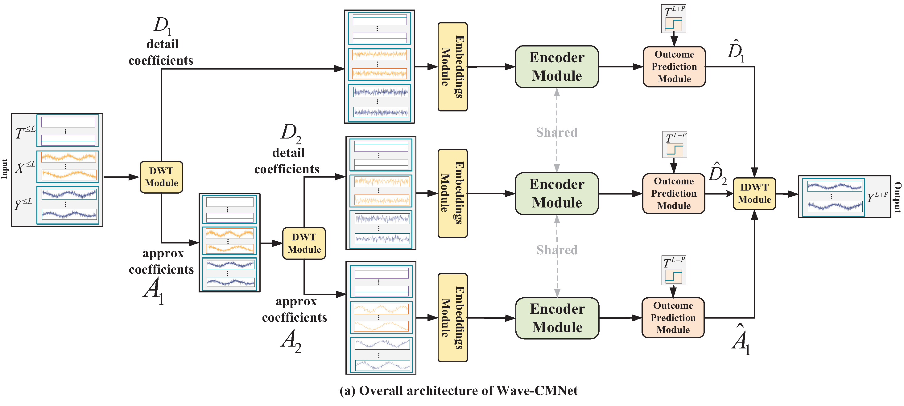

# Causal Modeling-Based Multivariate KPIs Prediction for Parameter Adjustment in Cellular Networks
The repo is the official implementation for the paper: Causal Modeling-Based Multivariate KPIs Prediction for Parameter Adjustment in Cellular Networks. 
## Overall Architecture

## China Mobile dataset
For details on the indicators (names and types) in the two China Mobile datasets, refer to dataset_1.md and dataset_2.md.

If you want to replace it with your own dataset, you only need to update the Dataset_Custom class in data_provider/data_loader.py. This involves modifying the data loading logic and configuring the look-back and forecast lengths.
## Usage
Train and evaluate the model. We provide all the above tasks under the folder ./scripts/. You can reproduce the results as the following examples:

  <pre>
    <code id="codeBlock">

bash ./scripts/model.sh
    </code>
  </pre>
  <button style="position: absolute; top: 0; right: 0; padding: 5px; background: #f5f5f5; border: none; cursor: pointer;" onclick="copyCode()">
    📋
  </button>

## Contact
If you have any questions or want to use the code, feel free to contact:

- ​**Zhenyu Zhang**: [zhangzhenyucad@bupt.edu.cn](mailto:zhangzhenyucad@bupt.edu.cn)

